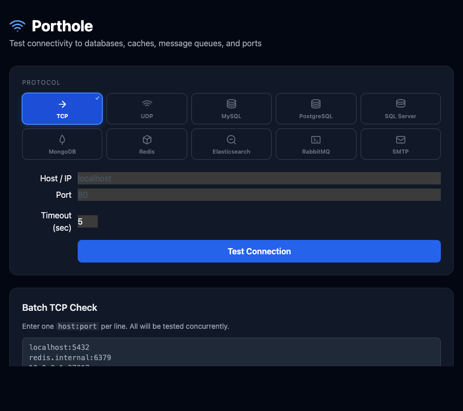

# Porthole

[English](README.md) | [日本語](README.ja.md)

Dockerで動作する軽量なWebベースの接続テストツールです。
データベース、キャッシュ、メッセージキュー、任意のTCP/UDPポートへの到達性と認証を、ブラウザからすばやく確認できます。

> [!WARNING]
> **Porthole は診断ツールであり、サービスではありません。認証機構は無く、指定された任意の
> ホスト・ポートへ接続する設計です。** ポートに到達できる人は誰でも内部ネットワークを
> 探索でき、エラーメッセージを含むチェック履歴も読めます。
> インターネットに公開したり、公開ロードバランサの背後に置いたりしないでください。
> 必要な間だけ起動し、ポートフォワードか localhost 経由でアクセスし、終わったら停止して
> ください。詳細は [AWSでの利用](#awsでの利用) を参照してください。

[](https://github.com/nobuo-miura/Porthole/actions/workflows/ci.yml)   



## 機能

- **TCP** — レイテンシ付きの生ポート接続チェック
- **UDP** — データグラムを送信し、応答あり / 確定的に閉（ICMP port unreachable）/
  判定不能 の3状態で報告します。詳細は [UDPの結果について](#udpの結果について)
- **MySQL / MariaDB** — ping、バージョン、認証済みユーザーの確認
- **PostgreSQL** — ping、バージョン、認証済みユーザーの確認
- **SQL Server** — ping、バージョン、認証済みユーザーの確認
- **MongoDB** — `connectionStatus` によるpingと認証済みユーザーの確認
- **Redis** — `PING` コマンドとパスワード認証
- **Elasticsearch** — `/_cluster/health` エンドポイント
- **RabbitMQ** — AMQPハンドシェイク
- **SMTP** — `EHLO` ハンドシェイク（メールは送信しません）
- **SSL/TLS** — プロトコルごとに設定可能（`disable` / `require` / `skip-verify` / `verify-ca` / `verify-full`）
- **バッチモード** — `host:port` の一覧を貼り付けて並行テスト
- **履歴** — 直近50件のチェック結果をメモリ上に保存

## クイックスタート

### Docker Hubから起動（推奨）

```bash
docker run -p 8080:8080 nobuomiura/porthole:latest
```

### Docker Composeでビルドして起動

```bash
docker compose up --build
```

ブラウザで **http://localhost:8080** を開きます。

### ポートを変更する

```bash
PORT=9090 docker compose up --build
```

### Dockerホスト上のサービスをテストする

`docker-compose.yml` の `extra_hosts` ブロックのコメントを外します。

```yaml
extra_hosts:
  - "host.docker.internal:host-gateway"
```

その後、UIのホスト名として `host.docker.internal` を使用します。

## 設定

| 環境変数 | フラグ | デフォルト | 説明 |
|---|---|---|---|
| `PORT` | `--port` | `8080` | HTTPの待ち受けポート |
| `HISTORY_SIZE` | `--history` | `50` | メモリ上に保持するチェック件数。`0` で履歴を無効化します。 |
| `PORTHOLE_PASSWORD` | — | — | `porthole check` で使うパスワード（[CLI](#cli) 参照） |

`--version` でビルドバージョンを表示して終了します。

## CLI

`porthole check` はWebサーバを起動せずにチェックを実行し、結果に応じた終了コードを返します。
シェルしか使えない環境（ECS Exec、`kubectl exec`）やCI/CDから利用できます。

```bash
porthole check --type tcp --host db.internal --port 5432
porthole check --type postgres --host db.internal --port 5432 --username app --database app
```

複数チェックと機械可読な出力:

```bash
echo '[{"type":"tcp","host":"a","port":80},{"type":"tcp","host":"b","port":443}]' \
  | porthole check --stdin --json
```

| 終了コード | 意味 |
|---|---|
| `0` | すべてのチェックで到達性を確認できた |
| `1` | 1件以上が確定的に失敗した |
| `2` | 失敗は無いが、判定不能の結果が残った |
| `3` | 引数または入力が不正 |

パスワードは `--password` より `PORTHOLE_PASSWORD` を推奨します。コマンド引数はホスト上の
他プロセスから見えます。全フラグは `porthole check --help` で確認できます。

## AWSでの利用

タスク定義と手順は [deploy/ecs/](deploy/ecs/README.md) にあります。要点は次の2点です。

- **アプリと同じタスクにサイドカーとして入れる** — 最も正確です。`awsvpc` のタスク内
  コンテナは単一のENIを共有するため、アプリと同じサブネット・Security Group・ルート
  テーブル・DNSリゾルバをそのまま再現できます。さらに `localhost` 経由でアプリ自身の
  リスナーも確認できます。
- **単発タスクとして起動する** — 手軽ですが、**アプリ自身のSecurity Group** をアタッチする
  必要があります（同じ設定のコピーでは不十分。ルールは通常、別のSecurity Groupを送信元
  として指定しているため）。サブネットもアプリが実際に使っているものを選びます。

公開せずにUIへアクセスするには、ECS Exec 経由のSSMポートフォワードを使います。ECS を
ターゲットにする場合、AWS が案内しているのは `host` パラメータを取る `...ToRemoteHost`
ドキュメントです。

```bash
aws ssm start-session \
  --target ecs:<CLUSTER>_<TASK_ID>_<RUNTIME_ID> \
  --document-name AWS-StartPortForwardingSessionToRemoteHost \
  --parameters '{"host":["127.0.0.1"],"portNumber":["8080"],"localPortNumber":["8080"]}'
```

サイドカー方式では 8080 がアプリのものなので `"portNumber":["8081"]` を使います。これには
タスクの `--enable-execute-command` が必要で、そのため Porthole コンテナでは
`readonlyRootFilesystem` を使えません（ECS Exec の SSM エージェントが書き込み可能な
ファイルシステムを必要とするため）。詳細は [deploy/ecs/](deploy/ecs/README.md) を参照。

## ローカル実行（Dockerなし）

```bash
go run .
# or
make run
```

Go 1.26.1以上が必要です。

## 開発

```bash
make check      # Go側のCIゲート: gofmt、go mod tidy、build、vet、lint、テスト
make check-all  # 上記 + Tailwind CSS の同期確認（Nodeが必要）
make test       # go test -race ./...
make cover      # カバレッジ要約付きでテスト
make tailwind   # web/tailwind.css を再生成
```

`make check` はCIの全部ではありません。Docker ビルドとスモークテストは
[CIワークフロー](.github/workflows/ci.yml) でのみ実行されます。それ以外のCIのチェックには
すべて対応するMakeターゲットがあり、CI側もそのターゲットを直接呼ぶことで乖離を防いでいます。

`make fmt` はファイルを書き換えますが、`make fmt-check` は報告のみです。`check` は後者を
使うため、整形されていないコードを黙って直すのではなく失敗します。

`make lint` には [golangci-lint](https://golangci-lint.run/docs/welcome/install/local/) が必要です。

### フロントエンドのCSS

ビルド済みの `web/tailwind.css` を同梱しているため、`go build` も Docker ビルドも Node を
必要とせず、外向き通信のない Private Subnet でもUIが表示されます。`tailwind/input.css` や
`web/` 配下のマークアップを編集したら `make tailwind`（Nodeが必要）を実行し、生成された
CSSをコミットしてください。古いままだとCIが失敗します。

カスタムCSSは [tailwind/input.css](tailwind/input.css) にあり、必ず `@tailwind utilities`
より**前**に置く必要があります。順序が逆になると `hidden` などのユーティリティが
コンポーネント側のルールに負けます。

## API

| Method | Path | Description |
|--------|------|-------------|
| `POST` | `/api/check` | 単一の接続チェックを実行 |
| `POST` | `/api/check/batch` | 複数のTCPチェックを並行実行 |
| `GET`  | `/api/history` | 直近N件のチェック結果を取得 |
| `GET`  | `/healthz` | ヘルスプローブ（ビルドバージョンを返します） |

### 例

```bash
curl -X POST http://localhost:8080/api/check \
  -H 'Content-Type: application/json' \
  -d '{
    "type": "postgres",
    "host": "db.example.com",
    "port": 5432,
    "username": "postgres",
    "password": "secret",
    "database": "myapp",
    "ssl_mode": "require",
    "timeout_sec": 5
  }'
```

```json
{
  "success": true,
  "outcome": "ok",
  "type": "postgres",
  "host": "db.example.com",
  "port": 5432,
  "latency_ms": 12,
  "detail": "PostgreSQL 16.2 on x86_64 | authenticated as postgres",
  "checked_at": "2026-03-21T10:00:00Z"
}
```

### 対応している `type` の値

`tcp`, `udp`, `mysql`, `mariadb`, `postgres`, `postgresql`, `mongodb`, `redis`, `elasticsearch`, `rabbitmq`, `smtp`, `sqlserver`, `mssql`

### プロトコルごとのSSLモード

4種類の挙動があり、プロトコル間で同じ名前を使います。

| 値 | TLS | 証明書チェーン | ホスト名 |
|---|---|---|---|
| `disable`、空 | 使わない | — | — |
| `skip-verify` | 使う | 検証しない | 検証しない |
| `verify-ca` | 使う | 検証する | **検証しない** |
| `verify-full` | 使う | 検証する | 検証する |

| Protocol | `disable` | `skip-verify` | `verify-ca` | `verify-full` | `require` |
|---|:-:|:-:|:-:|:-:|:-:|
| MySQL / MariaDB | ✅ | ✅ | ✅ | ✅ | = `verify-full` |
| PostgreSQL | ✅ | ✅ | ✅ | ✅ | = `skip-verify` |
| MongoDB | ✅ | ✅ | ✅ | ✅ | = `verify-full` |
| Redis | ✅ | ✅ | ✅ | ✅ | = `verify-full` |
| SQL Server | ✅ | ✅ | ❌ | ✅ | = `verify-full` |
| Elasticsearch | ✅（`http`） | ✅ | ✅ | ✅ | = `verify-full` |

> [!IMPORTANT]
> **非対応の値やタイプミスはエラーになり、黙って格下げされることはありません。**
> 検証を要求したのに暗号化されない接続になるのは、このツールで最も避けたい失敗の
> 仕方です。そのため SQL Server の `verify-ca` や `verify_full` のような打ち間違いは、
> 平文で接続するのではなく明確に失敗します。

> [!NOTE]
> `require` の意味はプロトコルごとに異なります。これは Porthole の独自解釈ではなく、
> 各ドライバの挙動に従った結果です。PostgreSQL 以外では証明書を検証するため
> `verify-full` と同じ意味になります。**PostgreSQL** では `lib/pq` が libpq の意味論を
> 実装しており、`sslmode=require` は検証せず暗号化のみなので `skip-verify` と同じ意味に
> なります。
>
> この曖昧さを避けるため、明示的な名前を使うことを推奨します。検証したい場合は
> `verify-full`、意図的に検証を外す場合は `skip-verify` です。

## 判定結果（outcome）

すべての結果は `success` に加えて `outcome` を持ちます。

| `outcome` | `success` | 意味 |
|---|---|---|
| `ok` | `true` | 到達性（該当する場合は認証まで）の肯定的な証拠が得られた |
| `failed` | `false` | 確定的な失敗（接続拒否、認証失敗など） |
| `indeterminate` | `false` | どちらとも判断できない |

`success` は `outcome == "ok"` と厳密に同義です。判定不能は到達性の証拠が無いため
`success: false` として報告しますが、失敗ではありません。UIでは赤ではなく
**UNKNOWN** として表示されます。

### UDPの結果について

UDPにはハンドシェイクが無いため、ソケットを開けても何も証明できません（ホスト名が
解決できたことのみ分かります）。Porthole はデータグラムを1つ送り、応答を分類します。

| 結果 | 条件 |
|---|---|
| `ok` | 相手が応答を返した。応答するプロトコル（DNS、NTP、SNMPなど）のみ該当 |
| `failed` | ICMP port unreachable が返った — 確定的に閉じている |
| `indeterminate` | タイムアウトまでに何も返ってこなかった |

reject ではなく **drop** するファイアウォール（AWS の Security Group を含む）では ICMP が
返らないため、ブロックされたポートと「開いているが応答しないポート」を区別できません。
そうした環境では `indeterminate` を「情報なし」として扱い、TCPチェックが可能なら
そちらを優先してください。

## ライセンス

MIT
