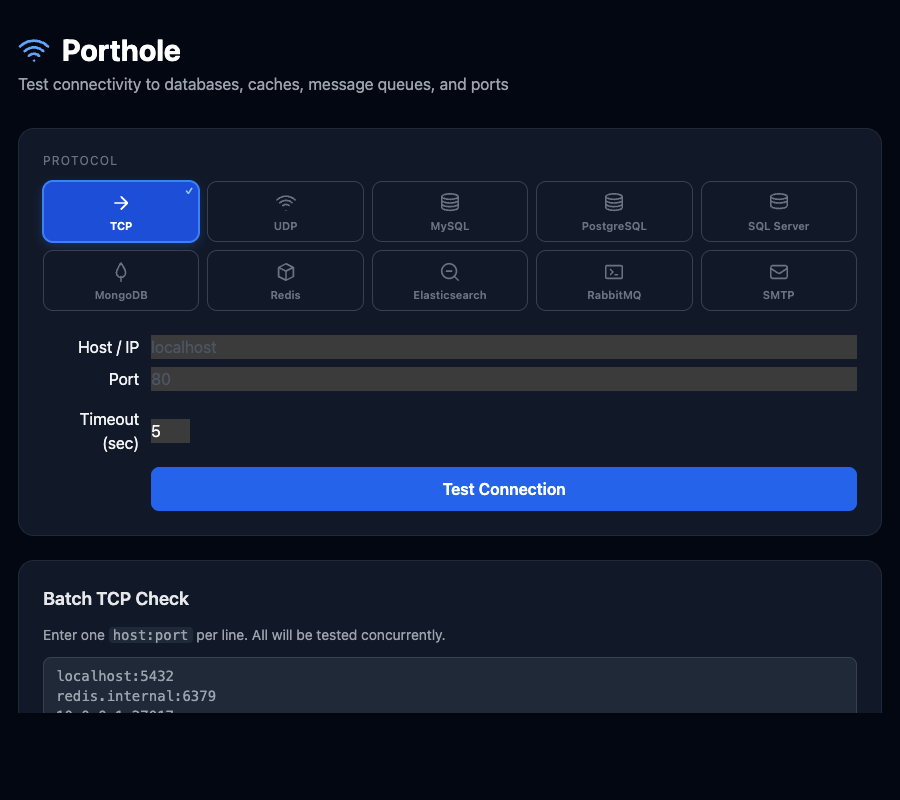

# Porthole

A lightweight, web-based connection testing tool that runs in Docker.
Quickly verify reachability and authentication of databases, caches, message queues, and arbitrary TCP/UDP ports — all from your browser.

  



## Features

- **TCP / UDP** — raw port connectivity check with latency
- **MySQL / MariaDB** — ping + version + authenticated user
- **PostgreSQL** — ping + version + authenticated user
- **SQL Server** — ping + version + authenticated user
- **MongoDB** — ping + authenticated user via `connectionStatus`
- **Redis** — `PING` command + password authentication
- **Elasticsearch** — `/_cluster/health` endpoint
- **RabbitMQ** — AMQP handshake
- **SMTP** — `EHLO` handshake (no email sent)
- **SSL/TLS** — configurable per protocol (`disable` / `require` / `skip-verify` / `verify-ca` / `verify-full`)
- **Batch mode** — paste a list of `host:port` entries and test them all concurrently
- **History** — last 50 checks stored in memory

## Quick Start

### Docker Hub から起動（推奨）

```bash
docker run -p 8080:8080 nobuomiura/porthole:latest
```

### docker compose でビルドして起動

```bash
docker compose up --build
```

Open **http://localhost:8080** in your browser.

### Changing the port

```bash
PORT=9090 docker compose up --build
```

### Testing services on the Docker host

Uncomment the `extra_hosts` block in `docker-compose.yml`:

```yaml
extra_hosts:
  - "host.docker.internal:host-gateway"
```

Then use `host.docker.internal` as the hostname in the UI.

## Running locally (without Docker)

```bash
go run .
# or
make run
```

Requires Go 1.22+.

## API

| Method | Path | Description |
|--------|------|-------------|
| `POST` | `/api/check` | Run a single connection check |
| `POST` | `/api/check/batch` | Run multiple TCP checks concurrently |
| `GET`  | `/api/history` | Retrieve last N check results |
| `GET`  | `/healthz` | Health probe |

### Example

```bash
curl -X POST http://localhost:8080/api/check \
  -H 'Content-Type: application/json' \
  -d '{
    "type": "postgres",
    "host": "db.example.com",
    "port": 5432,
    "username": "postgres",
    "password": "secret",
    "database": "myapp",
    "ssl_mode": "require",
    "timeout_sec": 5
  }'
```

```json
{
  "success": true,
  "type": "postgres",
  "host": "db.example.com",
  "port": 5432,
  "latency_ms": 12,
  "detail": "PostgreSQL 16.2 on x86_64 | authenticated as postgres",
  "checked_at": "2026-03-21T10:00:00Z"
}
```

### Supported `type` values

`tcp`, `udp`, `mysql`, `mariadb`, `postgres`, `postgresql`, `mongodb`, `redis`, `elasticsearch`, `rabbitmq`, `smtp`, `sqlserver`, `mssql`

### SSL modes by protocol

| Protocol | Supported values |
|---|---|
| MySQL / MariaDB | `disable`, `skip-verify`, `require` |
| PostgreSQL | `disable`, `require`, `verify-ca`, `verify-full` |
| MongoDB | `disable`, `skip-verify`, `require` |
| Redis | `disable`, `skip-verify`, `require` |
| SQL Server | `disable`, `skip-verify`, `require` |

## License

MIT
